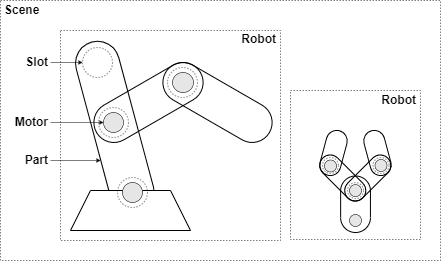
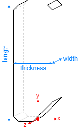
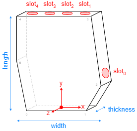
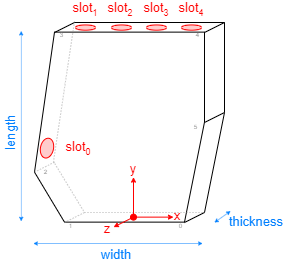

# Virtual prosthetics API

The Virtual Prosthetics library provides an API for all its functionalily. In
this document all times are in seconds, all sizes are in meters, all angles are
in radians and all indices start from 0.

* **[Introduction](#introduction)**
* **[Scene](#scene)**
	* [setAnimation](#setanimation), [setCameraPosition](#setcameraposition), [setCameraTarget](#setcameratarget), [getScene](#getscene), [getTime](#gettime)
* **[Robots](#robots)**
	* [Robot](#robot), [addChain](#addchain), [showSlots](#showslots)
	* [getPosition](#getposition), [setPosition](#setposition), [setRotation](#setrotation)
	* [getAngle](#getangle), [setAngle](#setangle), [setAngleRelative](#setanglerelative), [getAngles](#getangles), [setAngles](#setangles), [setAnglesRelatve](#setanglesrelative)
	* [getParts](#getparts), [getMotors](#getmotors), [getDOF](#getdof)
* **[Parts](#parts)**
	* [Part](#part), [setMotor](#setmotor)
	* [addSlot](#addslot), [attachToSlot](#attachtoslot)
	* [getAngle](#getangle-1), [setAngle](#setangle-1), [setAngleRelative](#setanglerelative-1)	
* **[Slots](#slots)**
	* [Slot](#slot), [setRotation](#setrotation-1), [show](#show)
* **[Sensors](#sensors)**
	* [Sensor](#sensor), [setRotation](#setrotation-2), [addLaser](#addlaser), [getLaser](#getlaser)
	* [senseDistance](#sensedistance), [senseTouch](#sensetouch), [sensePosition](#senseposition)
* **[Predefined parts](#predefined-parts)**
	* **[Motors](#motors)**: [MotorX](#motorx), [MotorY](#motory), [MotorZ](#motorz)
	* **[Shapes](#shapes)**: [Phalange](#phalange), [EndPhalange](#endphalange), [LeftPalm](#leftpalm), [RightPalm](#rightpalm)


# Introduction

The Virtual Prosthetics library allows construction of virtual robots from above
JavaScript program. The robots can be views and manipulated on desktop and
mobile platforms. The main concepts are:

* **Scene** – a virtual environment. It contains a ground where robots are
		placed and controlled. It also has a camera that define the viewing
		position.
* **Robot** – a virtual device constructed programmatically. It is made of one
		or more connected robot parts. The parts are connected in a tree
		hierarchy.
* **Robot part** – a building block of a robot. Some parts are just 3D shapes,
		other parts can be rotated.
* **Motor** – a robot part that can be rotated around a predefined axis. 
		Complex rotations are achieved by attaching several motors.
* **Slot** – a place on a robot part to which another body part can be attached.

<center></center>


# Scene

The Virtual Prosthetics library automatically creates a 3D scene that holds all
created prosthetic devices.

### setAnimation

```js
setAnimation( func, fps=30 )
```

Function. Defines what custom function `func` is called `fps` times per second.
The function has two parameters:
* `time` – elapsed time since the start of the library
* `dTime` – elapsed time since the previous frame

Higher `fps` produces smoother motion, but consumes more power. The maximal
value for `fps` is controlled by the browser and is usually 60 or above.

Example:

```js
Prosthetic.setAnimation( loop, 60 );

function loop( time, dTime )
{
	// changing devices postures
};
```


### setCameraPosition

```js
setCameraPosition( x, y, z );
```

Function. Moves the camera to coordinates (`x`,`y`,`z`). By default the camera
position is (4,4,7).

Examples:

```js
setCameraPosition( 10, 2, 0 );
```


### setCameraTarget

```js
setCameraTarget( x, y, z );
```

Function. Turns the camera towards coordinates (`x`,`y`,`z`). By default the
camera target is (0,0,0).

Examples:

```js
setCameraTarget( 0, 2, 0 );
```


### getScene

```js
getScene( );
```

Function. Gets the scene as a [`THREE.Scene`](https://threejs.org/docs/#api/en/scenes/Scene)
object that can be manipulated by [Three.js](https://threejs.org/).

Examples:

```js
scene = getScene( );
```


### getTime

```js
getSTime( );
```

Function. Gets the current time since the initialization of the library.

Examples:

```js
t = getTime( );
```


# Robots 

A robot is a device made of various robot parts. Some parts are just 3D shapes,
others are motors or sensors.


### Robot

Base class. Defines the overall functionality of a robot. A custom robot is a
class that extends this base class.

Example:

```js
class MyRobot extends Prosthetic.Robot
{
	constructor( )
	{
		super( );

		// defining robot parts
		// joining robot parts
	}
}
```


### addChain

```js
addChain( part1, part2, ... );
```

Method. Used in the constructor of a custom robot to automatically connect parts
`part1`, `part2` and so on in a chain. The variable `this` can be used to mark
the robot itself. If `this` is used in `addChain` it must be the first parameter.
At least one of the chains in a robot must start with `this`, otherwise the
robot parts will stay invisible.

Example:

```js
class MyRobot extends Prosthetic.Robot
{
	constructor( )
	{
		super( );

		this.partA = ...;
		this.partB = ...;
		
		this.addChain( this, this.partA, this.partB );
	}
}
```

Adding a chain always attaches parts to slot 0. If another slot or a custom
slot position is needed, use [`attachToSlot`](#attachtoslot) or
[`attachToPosition`](#attachtoposition) methods of the robot parts. 


### showSlots

```js
showSlots( );
```

Method. Shows the positions and orientations of all slots in a robot. This is
used during the robot construction. By default slots are not shown.

Example:

```js
robot.showSlots();
```


### getPosition

```js
getPosition( );
```

Method. Gets the position of a robot as an array of [x, y, z] coordinates.

Example:

```js
pos = robot.getPosition( );
```


### setPosition

```js
setPosition( x, y, z );
```

Method. Sets the position of a robot to (`x`,`y`,`z`). If the coordinates are not
provided, the robot is removed from the scene, but it is not deleted. The
default position of a robot is (0,0,0).

Example:

```js
robot.setPosition( 0, 10, 5 );
```


### setRotation

```js
setRotation( x, y, z, order='XYZ' );
```

Method. Sets the orientation of a robot to [Euler angles](https://threejs.org/docs/#api/en/math/Euler)
(`x`,`y`,`z`) and `order` of rotations.

Example:

```js
robot.setRotation( 0, Math.PI/2, 0 );
```


### getAngle

```js
getAngle( index );
```

Method. Gets the angle of the `index`-th motor. If such motor does not exist,
the result is 0. Use [`getAngles`](#getangles) to get all angles at once.

Example:

```js
a = robot.getAngle( 1 );
```


### setAngle

```js
setAngle( index, angle );
```

Method. Sets the `angle` of the `index`-th motor. If such motor does not exist
or if the `angle` is `null`, the operation is ignored. Use [`setAngles`](#setangles)
to set all angles at once.

Example:

```js
robot.setAngle( 1, Math.PI );
```


### setAngleRelative

```js
setAngleRelative( index, angle );
```

Method. Adds the `angle` to the current angle of the `index`-th motor. If such
motor does not exist or if the `angle` is `null`, the operation is ignored. Use
[`setAnglesRelative`](#setanglesrelative) to add to all angles at once.

Example:

```js
robot.setAngleRelative( 1, Math.PI );
```


### getAngles

```js
getAngles( );
```

Method. Gets an array with angles of all motors. Use [`getAngle`](#getangle) to
get an individual angle.

Example:

```js
a = robot.getAngles( );
```


### setAngles

```js
setAngles( angle1, angle2, ... );
```

Method. Sets the angles `angle1`, `angle2`, ... of all motors. If a value of
some angle is `null`, then the corresponding motor's angle is unchanged. Use
[`setAngle`](#setangle) to set an individual angle.

Example:

```js
robot.setAngles( Math.PI, 0, -Math.PI/2 );
```


### setAnglesRelative

```js
setAnglesRelative( angle1, angle2, ... );
```

Method. Adds the `angle1`, `angle2`, ... to the current angles of all motors. If
a value of some angle is `null`, then the corresponding motor's angle is
unchanged. Use [`setAngleRelative`](#setanglerelative) to add to an individual
angle.

Example:

```js
robot.setAnglesRelative( Math.PI, 0, -Math.PI/2 );
```


### getParts

```js
getParts( );
```

Method. Gets an array of all robot parts, including motors.

Example:

```js
parts = robot.getParts( );
```


### getMotors

```js
getMotors( );
```

Method. Gets an array of all robot motors. 

Example:

```js
motors = robot.getMotors( );
```


### getDOF

```js
getDOF( );
```

Method. Gets the overall degree of freedom (DOF) of a robot. The DOF is
effectively equal to the number of motors.

Example:

```js
dof = robot.getDOF( );
```


# Parts

### Part

Base class. Defines the core functionality of a robot part. Parts used in robots
are extensions of this base class. Each part may have slots where other parts
can be attached.

Example:
```js
class MyPart extends Part
{
	constructor ( ... )
	{
		super( );
		
		// defining part shape
		// added part slots
	}
}
```


### setMotor

```js
setMotor( axis, min=-Infinity, max=Infinity, def=0 )
```

Method. Sets that a robot part is a motor. A motor implements rotation around
an `axis` defined by the character `'x'`, `'y'` or `'z'`. The rotation is
restricted to interval [`min`, `max`] and the initial angle is `def`. 

Example:

```js
part.setMotor( 'x', 0, Math.PI, Math.PI/2 );
```


### addSlot

```js
addSlot( x, y, z );
```

Method. Adds a new slot to a robot part. The slot is at coordinates (`x`, `y`, `z`)
relative to the part. To rotate a slot use its method [`setRotation`](#setrotation).

Example:

```js
part.addSlot( 2, 0, 1 );
```


### attachToSlot

```js
attachToSlot( parentPart, slot=0 );
```

Method. Attaches the part to a `parentPart` at its `slot`. If `slot` is not
provided, the first slot of the parent is used. If `slot` is a number, it is the
slot index within all parent's slots. If `slot` is a [`Slot`](#slot), then the
part is attached to this temporary slot.

Example:

```js
partB.attachToSlot( partA );
partC.attachToSlot( partB, 2 );
partC.attachToSlot( partB, new Slot(0,3,0) );
```


### getAngle

```js
getAngle( );
```

Method. Gets the angle of the part if it has a motor set, otherwise return 0.

Example:

```js
a = part.getAngle( );
```


### setAngle

```js
setAngle( angle );
```

Method. Sets the motor's `angle` if the part has a motor. If `angle` is `null`,
the operation is ignored.

Example:

```js
part.setAngle( Math.PI );
```


### setAngleRelative

```js
setAngleRelative( angle );
```

Method. Adds `angle` the motor's current angle if the part has a motor. If
`angle` is `null`, the operation is ignored.

Example:

```js
part.setAngleRelative( Math.PI );
```


# Slots 

A slot is a position on a robot part where another part can be attach. The
orientation of the slot affects the orientation of the attached part. Several
parts can be attached to one slot.


### Slot

```js
Slot( x, y, z )
```

Class. Defines a slot at coordinates (`x`, `y`, `z`). These coordinates are
relative to the robot part of the slot.

Example:

```js
slot = new Slot( 0, 0, Math.PI/4 );
```


### setRotation

```js
setRotation( x, y, z, order='XYZ' );
```

Method. Sets the orientation of a slot to [Euler angles](https://threejs.org/docs/#api/en/math/Euler)
(`x`,`y`,`z`) and `order` of rotations. The orientation is relative to the
robot part of the slot.


Example:

```js
slot.setRotation( 0, Math.PI/2, 0 );
```


### show

```js
slot.show( );
```

Method. Shows the slot. This is used during the robot construction. Shown and
hidden slots are functionally equivalent.

Example:

```js
robot.show();
```


# Sensors 

A sensor is a robot part that measure some property and returns feedback. 
Sensors are attached to slots and use their orientation.


### Sensor

```js
Sensor( x, y, z )
```

Class. Defines a sensor at coordinates (`x`, `y`, `z`). These coordinates are
relative to the robot part of the slot.

Example:

```js
sensor = new Sensor( 0, 0, Math.PI/4 );
```


### setRotation

```js
setRotation( x, y, z, order='XYZ' );
```

Method. Sets the orientation of a sensor to [Euler angles](https://threejs.org/docs/#api/en/math/Euler)
(`x`,`y`,`z`) and `order` of rotations. The orientation is relative to the
robot part of the slot.


Example:

```js
sensor.setRotation( 0, Math.PI/2, 0 );
```


### addLaser

```js
sensor.addLaser( color='crimson' );
```

Method of `Sensor`. Creates a laser beam with optional `color` emitted by the sensor. This beam is for visual
representation only. Its exitance or non-existance do not affect the functionality
of a sensor. A sensor may have only one laser attached.

Example:

```js
sensor.addLaset( );
```


### getLaser

```js
sensor.getLaser( );
```

Method. Gets the laser object of a sensor.

Example:

```js
laser = sensor.getLaser( );
```


### senseDistance

```js
sensor.senseDistance( );
```

Method. Gets the distance to the nearest object (including the ground) looking
toward the direction of the sensor. If there is no object, the result is `Infinity`.

Example:

```js
dist = sensor.senseDistance( );
```


### sensePosition

```js
sensor.sensePosition( );
```

Method. Gets the 3D position of the sensor as an array of [`x`, `y`, `z`] coordinates.

Example:

```js
pos = sensor.sensePosition( );
```


--------------
# Predefined parts

## Motors

Motor parts are robot parts that can rotate around one of the axes. Thus, each
motor has DOF=1. Higher DOF is achieved by connecting several motors.


### MotorX

```js
MotorX( min, max, def, width=0.1, height=0.05 )
```

Class. Defines a simple motor that rotates around the X axis. The available
range for the rotation is from `min` to `max`. The initial value is `def`.
The size of the motor is defined by the optional parameters `width` and `height`.
There is one slot at position (0,0,0).


Example:

```js
new MotorX( 0, Math.PI, Math.PI/2 );
```


### MotorY

```js
MotorY( min, max, def, width=0.3, height=0.05 )
```

Class. Defines a simple motor that rotates around the Y axis. The available
range for the rotation is from `min` to `max`. The initial value is `def`.
The size of the motor is defined by the optional parameters `width` and `height`.
There is one slot at position (0,`height`,0).


Example:

```js
new MotorY( 0, Math.PI, Math.PI/2 );
```


### MotorZ

```js
MotorZ( min, max, def, width=0.1, height=0.05 )
```

Class. Defines a simple motor that rotates around the Z axis. The available
range for the rotation is from `min` to `max`. The initial value is `def`.
The size of the motor is defined by the optional parameters `width` and `height`.
There is one slot at position (0,0,0).


Example:

```js
new MotorZ( 0, Math.PI, Math.PI/2 );
```


## Shapes

Shapes are robot parts without motors. They cannot be rotated, unless they
are attached to a motor or are set as a motor with [`setMotor`](#setmotor).


### Phalange

```js
Phalange( length=1.0, width=0.3, thickness=0.3 )
```

Class. Defines a phalange-like shape for attachment to Z-motor. The parameters
`length`, `width` and `thickness` define the size of the part. There is one slot
at the top at position (0,`length`,0).


Example:

```js
new Phalange( 1, 0.2, 0.2 );
```


### EndPhalange

```js
EndPhalange( length=1.0, width=0.3, thickness=0.3 )
```

Class. Defines a phalange-like shape for attachment to Z-motor. The parameters
`length`, `width` and `thickness` define the size of the part. There are no
slots. The `EndPhalange` looks almost like `Phalange`, but is intended to be the
last part of a chain of phalanges. It has no slots.



Example:

```js
new EndPhalange( 1, 0.2, 0.2 );
```


### LeftPalm

```js
LeftPalm( length=1.4, width=1.4, thickness=0.3 )
```

Class. Defines a shape for palm of left hand. The parameters `length`, `width`
and `thickness` define the size of the palm. There are five slots for attaching
each finger.



Example:

```js
new LeftPalm( 1.5, 0.9, 0.3 );
```


### RightPalm

```js
RightPalm( length=1.4, width=1.4, thickness=0.3 )
```

Class. Defines a shape for palm of right hand. The parameters `length`, `width`
and `thickness` define the size of the palm. There are five slots for attaching
each finger.



Example:

```js
new RightPalm( 1.5, 0.9, 0.3 );
```


