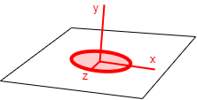
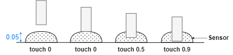

# Virtual prosthetics API

The Virtual Prosthetics library provides a set of APIs for constructing simple 
virtual robots. In this document all times are in seconds, all sizes are in
meters, all angles are in radians and all indices start from 0.

* **[Introduction](#introduction)**
* **[Scene API](#scene-api)**
	* <small>Animation: [setAnimation](#setanimation), [getTime](#gettime) [getScene](#getscene)</small>
	* <small>Camera: [setCameraPosition](#setcameraposition), [setCameraTarget](#setcameratarget)</small>
* **[Robots](#robots)**
	* <small>Structure: [Robot](#robot), [addChain](#addchain), [showSlots](#showslots), [getParts](#getparts), [getMotors](#getmotors), [getSensors](#getsensors), [getDOF](#getdof)</small>
	* <small>Position: [getPosition](#getposition), [setPosition](#setposition), [setRotation](#setrotation)</small>
	* <small>Angles: [getAngle](#getangle), [setAngle](#setangle), [setAngleRelative](#setanglerelative), [getAngles](#getangles), [setAngles](#setangles), [setAnglesRelatve](#setanglesrelative)</small>
* **[Parts](#parts)**
	* <small>Structure: [Part](#part), [setMotor](#setmotor),  [addSlot](#addslot), [attachToSlot](#attachtoslot), [beginContact](#begincontact), [endContact](#endcontact) </small>
	* <small>Position: [setPosition](#setposition-1), [setRotation](#setrotation-1)</small>
	* <small>Angles: [getAngle](#getangle-1), [setAngle](#setangle-1), [setAngleRelative](#setanglerelative-1)</small>
* **[Slots](#slots)**
	* <small>Structure: [Slot](#slot), [show](#show)</small>
	* <small>Position: [setPosition](#setposition-2), [setRotation](#setrotation-2)</small>
* **[Sensors](#sensors)**
	* <small>Structure: [Sensor](#sensor), [addLaser](#addlaser), [getLaser](#getlaser)</small>
	* <small>Feedback: [senseDistance](#sensedistance), [senseTouch](#sensetouch), [sensePosition](#senseposition), [senseCollision](#sensecollision), [senseObjects](#senseobjects), [senseObject](#senseobject)</small>


# Introduction

The Virtual Prosthetics library allows construction of virtual robots from a
JavaScript program. The robots can be viewed and manipulated on desktop and
mobile platforms. The library is base on the following main concepts:

* [**Scene**](#scene-api) – a virtual environment where robots are placed and controlled;
* [**Robot**](#robots) – a virtual device constructed programmatically of robot parts;
* **Part** – an element of a robot, that can be a shape, a motor or a slot;
* **Motor** – a robot part that can be rotated around a predefined axis;
* **Sensor** – a robot part that can sense its environment and generate feedback;
* **Slot** – a place on a robot part to which another elements can be attached.

<center></center>


# Scene API

The Virtual Prosthetics library automatically creates a 3D scene that contains
all created prosthetic devices.

Source code: [src/scene.js](https://github.com/boytchev/virtual-prosthetics/blob/main/src/scene.js)


> ### setAnimation

```js
setAnimation( func, fps=30 )
```

Function. Defines a callback function `func` to be called `fps` times per second.
Higher `fps` (or frames-per-second) produces smoother motion, but consumes more
computational resources. The maximal value for `fps` is controlled by the
browser and is usually 60 or more.

The callback function has optional parameters `time` for the elapsed time since
the start of the library; and `dTime` for the elapsed time since the previous frame.


Example:

```js
Prosthetic.setAnimation( loop, 60 );

function loop( time, dTime )
{
   // one step of the animation
};
```


> ### getTime

```js
getTime( );
```

Function. Gets the current time since the initialization of the library. Inside
the animation loop, the time is available as a parameter.

Example:

```js
time = Prosthetic.getTime( );
```


> ### getScene

```js
getScene( );
```

Function. Gets the scene as a [`THREE.Scene`](https://threejs.org/docs/#api/en/scenes/Scene)
object that can be manipulated by [Three.js](https://threejs.org/), e.g. for
adding custom Three.js objects.

Example:

```js
scene = Prosthetic.getScene( );
```


> ### setCameraPosition

```js
setCameraPosition( x, y, z )
```

Function. Places the camera at coordinates (`x,y,z`). Initially the camera is
placed at (4,4,7). The camera position can be changed in the animation loop to
control its motion programmatically.

Example:

```js
Prosthetic.setCameraPosition( 10, 2, 0 );
```


> ### setCameraTarget

```js
setCameraTarget( x, y, z )
```

Function. Turns the camera towards coordinates (`x,y,z`), so that they are in
the center of the screen. Initially the camera target is (0,0,0). The camera
target can be changed in the animation loop to control its rotation
programmatically.

Example:

```js
Prosthetic.setCameraTarget( 0, 2, 0 );
```


# Robots 

A robot is a device made of various robot parts. Some parts are just 3D shapes,
others are motors or sensors.


### Robot

Base class. Defines the overall functionality of a robot. A custom robot is a
class that extends this base class.

Example:

```js
class MyRobot extends Prosthetic.Robot
{
	constructor( )
	{
		super( );

		// defining robot parts
		// joining robot parts
	}
}
```


### addChain

```js
addChain( part1, part2, ... )
```

Method. Used in the constructor of a custom robot to automatically connect parts
`part1`, `part2` and so on in a chain. Method `addChain` is a shorthand
for a sequence of [`attachToSlot`](#attachtoslot). The variable `this` can be
used to mark the robot itself. If `this` is used in `addChain` it must be the
first parameter. At least one of the chains in a robot must start with `this`,
otherwise the robot parts will stay invisible.

Example:

```js
class MyRobot extends Prosthetic.Robot
{
	constructor( )
	{
		super( );

		var partA = ...;
		var partB = ...;
		
		this.addChain( this, partA, partB );
	}
}
```

Adding a chain always attaches parts to slot 0. If another slot or a custom
slot position is needed, use [`attachToSlot`](#attachtoslot). 


### showSlots

```js
showSlots( )
```

Method. Shows the positions and orientations of all slots in a robot. A slot is visualized as a circle with unnamed axes. This is used during the robot
construction. By default slots are not shown.



Example:

```js
robot.showSlots();
```


### getPosition

```js
getPosition( )
```

Method. Gets the position of a robot as an array of [x, y, z] coordinates.

Example:

```js
pos = robot.getPosition( );
```


### setPosition

```js
setPosition( x, y=0, z=0 )
```

Method. Sets the position of a robot to (`x,y,z`). If the coordinates are
not provided, the robot is removed from the scene, but it is not deleted. The
default position of a robot is (0,0,0).

Example:

```js
robot.setPosition( 0, 10, 5 );
```


### setRotation

```js
setRotation( x, y=0, z=0, order='XYZ' )
```

Method. Sets the orientation of a robot to [Euler angles](https://threejs.org/docs/#api/en/math/Euler)
(`x,y,z`) and `order` of rotations.

Example:

```js
robot.setRotation( 0, Math.PI/2, 0 );
```


### getAngle

```js
getAngle( index )
```

Method. Gets the angle of the `index`-th motor. If such motor does not exist,
the result is 0. Use [`getAngles`](#getangles) to get all angles at once.

Example:

```js
a = robot.getAngle( 1 );
```


### setAngle

```js
setAngle( index, angle )
```

Method. Sets the `angle` of the `index`-th motor. If such motor does not exist
or if the `angle` is `null`, the operation is ignored. Use
[`setAngles`](#setangles) to set all angles at once.

Example:

```js
robot.setAngle( 1, Math.PI );
```


### setAngleRelative

```js
setAngleRelative( index, angle )
```

Method. Adds the `angle` to the current angle of the `index`-th motor. If such
motor does not exist or if the `angle` is `null`, the operation is ignored. Use
[`setAnglesRelative`](#setanglesrelative) to add to all angles at once.

Example:

```js
robot.setAngleRelative( 1, Math.PI );
```


### getAngles

```js
getAngles( )
```

Method. Gets an array with angles of all motors. Use [`getAngle`](#getangle) to
get an individual angle.

Example:

```js
a = robot.getAngles( );
```


### setAngles

```js
setAngles( angle1, angle2, ... )
```

Method. Sets the angles `angle1`, `angle2`, ... of all motors. If a value of
some angle is `null`, then the corresponding motor's angle is unchanged. Use
[`setAngle`](#setangle) to set an individual angle.

Example:

```js
robot.setAngles( Math.PI, 0, -Math.PI/2 );
```


### setAnglesRelative

```js
setAnglesRelative( angle1, angle2, ... )
```

Method. Adds the `angle1`, `angle2`, ... to the current angles of all motors. If
a value of some angle is `null`, then the corresponding motor's angle is
unchanged. Use [`setAngleRelative`](#setanglerelative) to add to an individual
angle.

Example:

```js
robot.setAnglesRelative( Math.PI, 0, -Math.PI/2 );
```


### getParts

```js
getParts( )
```

Method. Gets an array of all robot parts, including motors.

Example:

```js
parts = robot.getParts( );
```


### getMotors

```js
getMotors( )
```

Method. Gets an array of all robot motors. 

Example:

```js
motors = robot.getMotors( );
```


### getSensors

```js
getSensors( )
```

Method. Gets an array of all robot sensors. 

Example:

```js
sensors = robot.getSensors( );
```


### getDOF

```js
getDOF( )
```

Method. Gets the overall degree of freedom (DOF) of a robot. The DOF is
effectively equal to the number of motors, as each motor can be manipulated
independently on other motors.

Example:

```js
dof = robot.getDOF( );
```


# Parts

### Part

Base class. Defines the core functionality of a robot part. Parts used in robots
are extensions of this base class. Each part may have slots where other parts
can be attached. Motors and [sensors](#sensors) are parts too.

Example:
```js
class MyPart extends Part
{
	constructor ( ... )
	{
		super( );
		
		// defining part shape
		// adding part slots
	}
}
```


### setMotor

```js
setMotor( axis, min=-Infinity, max=Infinity, def=0 )
```

Method. Sets a robot part as a motor. A motor implements rotation around
an `axis` defined by the character `'x'`, `'y'` or `'z'`. The rotation is
restricted to interval [`min`, `max`] and the initial angle is `def`. 

Example:

```js
part.setMotor( 'x', 0, Math.PI, Math.PI/2 );
```


### addSlot

```js
addSlot( x, y, z )
```

Method. Adds a new [slot](#slots) to a robot part. The slot is at coordinates
(`x,y,z`) relative to the part. To rotate a slot use its method
[`setRotation`](#setrotation).

Example:

```js
part.addSlot( 2, 0, 1 );
```


### attachToSlot

```js
attachToSlot( parentPart, slot=0 )
```

Method. Attaches the part to a `parentPart` at its `slot`.
* If `slot` is not provided, the first slot of the parent is used. If the parent
has no slots, the part is directly attached to the parent. 
* If `slot` is a number, it is the slot index within all parent's slots.
* If `slot` is a [`Slot`](#slot), then the part is attached to this temporary slot.
* If `slot` is the [scene](#getscene) the part is a sdandalone part in the scene.
All parts are initially created as attached to the scene.

Example:

```js
partB.attachToSlot( partA );
partB.attachToSlot( partA, 2 );
partB.attachToSlot( partA, new Slot(0,3,0) );
partB.attachToSlot( getScene() );
```


### beginContact

```js
beginContact( otherObject )
```

Method. This method is automatically called when the physics engine detects a
contact of this part with another part. The other part is passed as `otherObject` parameter. The main purpose of `beginContect` is to define the behaviour when
the part collides with another part.

Example:

```js
class MyPart extends Part
{
	beginContact( otherObject )
	{
		// reaction of contact
	}
}
```


### endContact

```js
endContact( otherObject )
```

Method. This method is automatically called when the physics engine detects a
lost of contact of this part with another part. The other part is passed as `otherObject` parameter. The main purpose of `endContect` is to define the behaviour when the part parts away from another part.

Example:

```js
class MyPart extends Part
{
	endContact( otherObject )
	{
		// reaction of lost contact
	}
}
```


### setPosition

```js
setPosition( x, y=0, z=0 )
```

Method. Sets the position of a part to (`x,y,z`). The position is relative to
the part's parent.

Example:

```js
part.setPosition( 0, 10, 5 );
```


### setRotation

```js
setRotation( x, y=0, z=0, order='XYZ' )
```

Method. Sets the orientation of a part to [Euler angles](https://threejs.org/docs/#api/en/math/Euler)
(`x,y,z`) and `order` of rotations. The rotation is relative to the part's parent.

Example:

```js
part.setRotation( 0, Math.PI/2, 0 );
```


### getAngle

```js
getAngle( )
```

Method. Gets the angle of the part if it has a motor set, otherwise returns 0.

Example:

```js
a = part.getAngle( );
```


### setAngle

```js
setAngle( angle )
```

Method. Sets the motor's `angle` if the part has a motor. If `angle` is `null`,
the operation is ignored.

Example:

```js
part.setAngle( Math.PI );
```


### setAngleRelative

```js
setAngleRelative( angle )
```

Method. Adds `angle` the motor's current angle if the part has a motor. If
`angle` is `null`, the operation is ignored.

Example:

```js
part.setAngleRelative( Math.PI );
```


# Slots 

A slot is a position on a robot part where another part can be attach. The
orientation of the slot affects the orientation of the attached part. Several
parts can be attached to one slot.


### Slot

```js
Slot( x=0, y=0, z=0 )
```

Class. Defines a slot at coordinates (`x,y,z`). These coordinates are relative
to the robot part of the slot when it is added with [`addSlot`](#addslot).

Example:

```js
slot = new Slot( 0, 4, 1 );
```


### setPosition

```js
setPosition( x, y=0, z=0 )
```

Method. Sets the position of a slot to (`x,y,z`). The position is relative to
the slot's part.

Example:

```js
slot.setPosition( 0, 10, 5 );
```


### setRotation

```js
setRotation( x, y=0, z=0, order='XYZ' );
```

Method. Sets the orientation of a slot to [Euler angles](https://threejs.org/docs/#api/en/math/Euler)
(`x,y,z`) and `order` of rotations. The orientation is relative to the robot
part of the slot.


Example:

```js
slot.setRotation( 0, Math.PI/2, 0 );
```


### show

```js
show( )
```

Method. Shows the slot. This is used during the robot construction. Shown and
hidden slots are functionally equivalent. Method `show` is automatically called
by robot's [`showSlots`](#showslots).

Example:

```js
slot.show();
```


# Sensors 

A sensor is a robot part that measures some property and returns its value as a
feedback. Sensors are attached to slots (with [`attachToSlot`](#attachtoslot))
and use their position and orientation. Sensors are also robot parts so they
have their methods like [`setPosition`](#setposition) and [`setRotation`](#setrotation).


### Sensor

```js
Sensor( visible=true )
```

Class. Defines a sensor. If `visible` is true, the sensor pad is drawn, otherwise
the sensor is invisible, but functional.

Example:

```js
sensor = new Sensor( );
```


### addLaser

```js
addLaser( color='crimson' )
```

Method of `Sensor`. Creates a laser beam with optional `color` emitted by the
sensor. This beam is for visual representation only. Its exitance or non-existance
do not affect the functionality of the sensor. A sensor may have only one laser
attached.

Example:

```js
sensor.addLaser( );
```


### getLaser

```js
getLaser( )
```

Method. Gets the laser object of a sensor.

Example:

```js
laser = sensor.getLaser( );
```


### senseDistance

```js
senseDistance( )
```

Method. Gets the distance from the sensor position to the nearest object
(including the ground) along the direction of the sensor. If there is no object,
the result is `Infinity`.

Example:

```js
dist = sensor.senseDistance( );
```


### senseTouch

```js
senseTouch( )
```

Method. Gets the close-up distance from the sensor position to the nearest
object (including the ground) along the direction of the sensor. Touch is senseDistance
only for distances from 0 to 0.05. The returned value is a number from 0 to 1
indicating the level of touching, i.e. 0 means no touching, 1 means complete touching.
If there is no object that close, the result is 0.



Example:

```js
touch = sensor.senseTouch( );
```


### sensePosition

```js
sensePosition( )
```

Method. Gets the 3D position of the sensor as an array of [`x,y,z`] coordinates.

Example:

```js
pos = sensor.sensePosition( );
```


### senseCollision

```js
senseCollision( )
```

Method. Returns `true` when the part containing the sensor collides
(or intersects) another part or the ground, otherwise returns `false`.

Example:

```js
if( sensor.senseCollision( ) )
{
   ...
}
```


### senseObjects

```js
senseObjects( )
```

Method. Returns a list of all bodies that collide (or intersects) with the part,
containing the sensor. 

Example:

```js
objects = sensor.senseObjects( );
```


### senseObject

```js
senseObject( otherObject )
```

Method. Returns `true` when the part containing the sensor collides
(or intersects) the `otherObject`, otherwise returns `false`.

Example:

```js
if( sensor.senseObject( ball ) )
{
   ...
}
```


