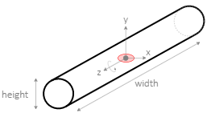

# Virtual prosthetics API

The Virtual Prosthetics library provides an API for all its
functionalily.

All times are in seconds.
All sizes are in meters.
All angles are in radians.
All indices start from 0.

* **[Scene](#scene)**
	* [setAnimation](#setanimation)
	* [setCameraPosition](#setcameraposition)
* **[Robot construction](#robot-construction)**
	* [Robot](#robot)
	* [addChain](#addchain)
	* [getPosition](#getposition), [setPosition](#setposition)
* **[Robot control](#robot-control)**
	* [getAngle](#getangle), [setAngle](#setangle), [getAngles](#getangles), [setAngles](#setangles)
	* [getParts](#getparts), [getMotors](#getmotors), [getDOF](#getdof)
* **[Part contruction](#part-construction)**
	* [Part](#part)
	* [setMotor](#setmotor)
	* [addSlot](#addslot), [attachToSlot](#attachtoslot), [attachToPosition](#attachtoposition)
* **[Part control](#part-control)**
	* [getAngle](#getangle-1), [setAngle](#setangle-1)	
* **[Motor parts](#motor-parts)**
	* [MotorX](#motorx), [MotorY](#motory), [MotorZ](#motorz)
* **[Static parts](#static-parts)**
	* [Phalange](#phalange), [EndPhalange](#endphalange)

# Scene

The Virtual Prosthetics library automatically creates a 3D
scene that will hold all created prosthetic devices.

### setAnimation

```js
setAnimation( func, fps )
```

Function. Defines a custom function `func` that is called
`fps` times per second. The function has two parameters:
* `time` elapsed time since the start of the library
* `dTime` elapsed time since the previous frame

By default `fps` (frame per seconds) is set to 30. Higher
`fps` produces smoother motion, but consumes more power. The
maximal value for `fps` is controlled by the browser and is
usually 60 or above.

Example:

```js
Prosthetic.setAnimation( loop, 60 );

function loop( t, dT )
{
	// changing devices postures
};
```


### setCameraPosition

```js
setCameraPosition( x, y, z );
```

Method. Moves the camera to coordinates (`x`,`y`,`z`).

Example:

```js
setCameraPosition( 10, 2, 0 );
```


# Robot construction

A robot is a device made of various robot parts. Some parts
are static elements, others are motors or sensors.

### Robot

Base class. Defines the overall functionality of a robot. A
custom robot is a class that extends this base class.

Example:

```js
class MyRobot extends Prosthetic.Robot
{
	constructor( )
	{
		super( );

		// defining robot parts
		// joining robot parts
	}
}
```


### addChain

```js
addChain( part1, part2, ... );
```

Method. Used in the constructor of a custom robot to
automatically connect parts `part1`, `part2` and so on in
a chain. The variable `this` can be used to mark the robot
itself. If `this` is used in `addChain` it must be the first
parameter. At least one of the chains in a robot mst start
with `this`, otherwise robot parts will stay invisible.


Example:

```js
class MyRobot extends Prosthetic.Robot
{
	constructor( )
	{
		super( );

		this.partA = ...;
		this.partB = ...;
		
		this.addChain( this, this.partA, this.partB );
	}
}
```

Adding a chain always attaches parts to slot 0. If another
slot or a custom position is needed, use [`attachTo`](#attachto) and [`attachToPosition`](#attachtoposition) methods of the
robot parts. 


### getPosition

```js
getPosition( );
```

Method. Gets the position of a robot as an array of [x, y, z]
coordinates.

Example:

```js
pos = robot.getPosition( );
```


### setPosition

```js
setPosition( x, y, z );
```

Method. Sets the position of a robot to `[x,y,z]`. If the
coordinates are not provided, the robot is removed from the
scene, but it is not deleted. The default position of a
robot is [0,0,0].

Example:

```js
robot.setPosition( 0, 10, 5 );
```


# Robot control


### getAngle

```js
getAngle( index );
```

Method. Gets the angle of the `index`-th motor. If such
motor does not exist, the result is 0.

Example:

```js
a = robot.getAngle( 1 );
```


### setAngle

```js
setAngle( index, angle );
```

Method. Sets the `angle` of the `index`-th motor. If such
motor does not exist or if the `angle` is `null`, the
operation is ignored.

Example:

```js
robot.setAngle( 1, Math.PI );
```


### getAngles

```js
getAngles( );
```

Method. Gets an array with angles of all motors.

Example:

```js
a = robot.getAngles( );
```


### setAngles

```js
setAngles( angle1, angle2, ... );
```

Method. Sets the angles of all motors. `angles` is an array
of the angles. If a value of some angle is `null`, then the
corresponding motor's angle is unchanged.

Example:

```js
robot.setAngles( Math.PI, 0, -Math.PI/2 );
```


### getParts

```js
getParts( );
```

Method. Gets an array of all robot parts, including motors.

Example:

```js
parts = robot.getParts( );
```


### getMotors

```js
getMotors( );
```

Method. Gets an array of all robot motors. 

Example:

```js
motors = robot.getMotors( );
```


### getDOF

```js
getDOF( );
```

Method. Gets the overall degree of freedom (DOF) in a robot.
The DOF is effectively equal to the number of motors.

Example:

```js
dof = robot.getDOF( );
```


# Part contruction

### Part

Base class. Defines the core functionality of a robot part.
Parts used in robots are extensions of this base class. Each
part may have slots -- these are positions on the part where
other parts can be attached.


### setMotor

```js
setMotor( axis, min, max, def );
```

Method. Sets the motor behaviour to a robot part -- `axis`
of rotation, `min` angle, `max` angle and default angle
`def`. The motor cannot be set to an angle outside the
[`min`, `max`] interval. By default the angle is not
restricted (i.e. `min` is `-Infinity`, `max` is `Infinity`],
and `def` is 0.

Example:

```js
part.setMotor( 'x', 0, Math.PI, Math.PI/2 );
```


### addSlot

```js
addSlot( x, y, z );
```

Method. Adds a new slot to a robot part. The slot is at 
coordinates (`x`, `y`, `z`) relative to the part. 

Example:

```js
part.addSlot( 2, 0, 1 );
```


### attachToSlot

```js
attachToSlot( parentPart, slot=0 );
```

Method. Attaches the part to another `parentPart` at its
`slot` number. If `slot` is not provided, the first slot is
used. A part must be attached to only one other part or the
robot itself.

Example:

```js
partB.attachToSlot( partA );
partC.attachToSlot( partB, 2 );
```


### attachToPosition

```js
attachToPosition( parentPart, x=0, y=0, z=0 );
```

Method. Attaches the part to another `parentPart` at given
coordinates (`x`, `y`, `z`) relative to the parent part.

Example:

```js
partA.attachToPosition( robot );
partB.attachToPosition( partB, 0, 5, 0 );
```


# Part control


### getAngle

```js
getAngle( );
```

Method. Gets the angle of the part if it has a motor set,
otherwise return 0.

Example:

```js
a = part.getAngle( );
```


### setAngle

```js
setAngle( angle );
```

Method. Sets the motor's `angle` if the part has a motor.
If `angle` is `null`, the operation is ignored.

Example:

```js
part.setAngle( Math.PI );
```


# Motor parts

Motor parts are robot parts that can rotate around one of the axes. Thus, each
motor has DOF=1. Higher DOF is achieved by connecting several motors.


### MotorX

```js
new MotorX( min, max, def, width, height );
```

Class. Defines a simple motor that rotates around the X axis. The available
range for the rotation is from `min` to `max`. The initial value is `def`.
The size of the motor is defined by the optional parameters `width` and `height`.
There is one slot at position (0,0,0).


Example:

```js
new MotorX( 0, Math.PI, Math.PI/2 );
```


### MotorY

```js
new MotorY( min, max, def, width, height );
```

Class. Defines a simple motor that rotates around the Y axis. The available
range for the rotation is from `min` to `max`. The initial value is `def`.
The size of the motor is defined by the optional parameters `width` and `height`.
There is one slot at position (0,`height`,0).


Example:

```js
new MotorY( 0, Math.PI, Math.PI/2 );
```


### MotorZ

```js
new MotorZ( min, max, def, width, height );
```

Class. Defines a simple motor that rotates around the Z axis. The available
range for the rotation is from `min` to `max`. The initial value is `def`.
The size of the motor is defined by the optional parameters `width` and `height`.
There is one slot at position (0,0,0).



Example:

```js
new MotorZ( 0, Math.PI, Math.PI/2 );
```


# Static parts

Static part are robot parts without motors. They cannot be rotated, unless they
are attached to a motor.


### Phalange

```js
new Phalange( length, width, thickness );
```

Class. Defines a static part designed for attachment to Z-motor. The parameters
`length`, `width` and `thickness` define the size of the part. There is one slot
at the top of the part at position (0,`length`,0).


Example:

```js
new Phalange( 1, 0.2, 0.2 );
```


### EndPhalange

```js
new EndPhalange( length, width, thickness );
```

Class. Defines a static part designed for attachment to Z-motor. The parameters
`length`, `width` and `thickness` define the size of the part. There are no
slots. The `EndPhalange` looks like `Phalange`, but is intended to be the last
part of a chain of phalanges.


Example:

```js
new EndPhalange( 1, 0.2, 0.2 );
```


