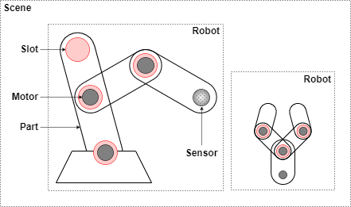

# Virtual prosthetics

The Virtual Prosthetics library provides a set of APIs for constructing simple 
virtual robots. In this document all times are in seconds, all sizes are in
meters, all angles are in radians and all indices start from 0.


* **[INTRODUCTION](#introduction)**<small>: [installation](#installation), [options](#options)</small>
	* **[Robot parts](#robot-parts)**<small><br> 
	  &ndash; [common shapes](#common-shapes): [`Ball`](#ball), [`Box`](#box)<br>
	  &ndash; [external shapes](#external-shapes): [`GLTFPart`](#gltfpart), [`recolor`](#recolor)<br>
	  &ndash; [motors](#motors): [`MotorX`](#motorx), [`MotorY`](#motory), [`MotorZ`](#motorz)</small>
	* **[Hand parts](#hand-parts)**<small><br>
	  &ndash; [edged hand](#edged-hand): [`EdgedFinger`](#edgedfinger), [`EdgedTip`](#edgedtip), [`EdgedPalm`](#edgedpalm)<br>
	  &ndash; [round hand](#round-hand): [`RoundFinger`](#roundfinger), [`RoundPalm`](#roundpalm)</small>
* **[API REFERENCE](#apireference)**
	* **[Scene API](#scene-api)**<small>: [`setAnimation`](#setanimation), [`getTime`](#gettime), [`getScene`](#getscene), [`setCameraPosition`](#setcameraposition), [`setCameraTarget`](#setcameratarget)</small>
	* **[Robot API](#robot-api)**:<small> [`Robot`](#robot)<br>
	  &ndash; [`addChain`](#addchain)<br>
	  &ndash; [`getParts`](#getparts), [`getMotors`](#getmotors), [`getSensors`](#getsensors)<br>
	  &ndash; [`getPosition`](#getposition), [`setPosition`](#setposition), [`setRotation`](#setrotation)<br>
	  &ndash; [`getAngle`](#getangle), [`setAngle`](#setangle), [`getAngles`](#getangles), [`setAngles`](#setangles)</small>
	* **[Part API](#part-api)**:<small> [`Part`](#part)<br>
	  &ndash; [`addSlot`](#addslot), [`attachToSlot`](#attachtoslot)<br>
	  &ndash; [`beginContact`](#begincontact), [`endContact`](#endcontact)<br>
	  &ndash; [`setPosition`](#setposition-1), [`setRotation`](#setrotation-1)</small>
	* **[Motor API](#motor-api)**:<small> [`Motor`](#motor)<br>
	  &ndash; [`getAngle`](#getangle-1), [`setAngle`](#setangle-1)</small>
	* **[Slot API](#slot-api)**:<small> [`Slot`](#slot)<br>
	  &ndash; [`setPosition`](#setposition-2), [`setRotation`](#setrotation-2)</small>
	* **[Sensor API](#sensor-api)**:<small> [`Sensor`](#sensor)<br>
	  &ndash; [`senseDistance`](#sensedistance), [`senseTouch`](#sensetouch), [`sensePosition`](#senseposition)<br>
	  &ndash; [`senseCollision`](#sensecollision), [`senseObjects`](#senseobjects), [`senseObject`](#senseobject)</small>


# Introduction

The Virtual Prosthetics library allows construction of virtual robots from a
JavaScript program. The robots can be viewed and manipulated on desktop and
mobile platforms. The library is base on the following main concepts:

* [**Scene**](#scene-api) – a virtual environment where robots are placed and controlled;
* [**Robot**](#robot-api) – a virtual mechanism constructed programmatically of sevral parts;
* [**Part**](#part-api) – a building element of a robot &ndash; a shape, a motor or a sensor;
* [**Motor**](#motor-api) – a robot part that can be rotated around a predefined axis;
* [**Slot**](#slot-api) – a place on a robot part to which another elements can be attached;
* [**Sensor**](#sensor-api) – a robot part that can sense its environment and generate feedback.

<center></center>


> ### Installation

**Virtual Prosthetics** is distributed as a single JavaScript file called
`virtual-prosthetics.js`. It does not require any specific installation. The
library file could be placed anywhere within the project folder tree or hosten
on a CORS-enabled repository. 


The library provides its functionality via modules and it is used within a
module script:


```html
<script type="module">
	// JS code
</script>
```

The library is loaded (and activated) via `import` statement. The following
example assumes the library is in current folder:

```js
import * as Prosthetic from "./virtual-prosthetics.js";
```

If the library is activated, it prints the text **Virtual Prosthetics 1.0** in
the console. Activation creates a virtual scene with the Virtual Prosthetics
logo spinning in the center:

[<kbd></kbd>](../examples/empty-scene.html)


> ### Options

Some run-time aspects of the library can be controlled by URL parameters (also
called [query strings](https://en.wikipedia.org/wiki/Query_string)). Some of the
parameters are pairs of **name=vaue**, others are just flags and are only
**name**.

* `engine=‹engine-name›`

	Controls which physics engine to use. Available options are `engine=cannon` 
	that sets [Cannon-es](https://pmndrs.github.io/cannon-es/) as physics engine
	(default) and `engine=native` for a native engine. Currently on the cannon
	engine is fully functional.

* `touch-color=‹color-name›`

	Controls the emissive color indication of colliding parts. Any [CSS color name](https://www.w3schools.com/tags/ref_colornames.asp) can be used, but dark
	colors have minimal or no effect. For example, `touch-color=crimson` adds a
	pale pinkinsh color to parts, while `touch-color=black` does not produce any
	effect.

* `debug-physics`

	Shows how the physics engine "sees" the parts. Each part has an invisible
	convex envelope that is used for collision testing. If th flag `debug-physics`
	is used, the edges of the envelope are shown. By default they are hidden.

* `show-slots`

	Shows the positions and orientations of all slots. By default slots are hidden.


Example:
```
../examples/two-hands.html?engine=cannon&touch-color=crimson&debug-physics&show-slots
```

[<kbd></kbd>](https://boytchev.github.io/virtual-prosthetics/examples/two-hands.html?engine=cannon&touch-color=crimson&debug-physics&show-slots)


# Robot parts

Robot parts are predefined [parts](api.md#parts-api) that have images. Some
robot parts also have invisible physics envelopes that are used the the physics
engine for collision detection.


## Common shapes

Shapes are robot parts without motors. They can be positioned with
[setPosition](api.md#setposition-1) and rotated with [setRotation](api.md#setrotation-1).
Common shapes have exact physics envelopes and the engine uses them for precise
collision detection. 

Source code: [src/part-shapes.js](https://github.com/boytchev/virtual-prosthetics/blob/main/src/part-shapes.js)


> ### Ball

```js
Ball( )
Ball( radius )
Ball( radius, color )
```

Class. Defines a ball shape with optional `radius` (by default 1) and `color` (by
default [DimGray](https://www.w3schools.com/colors/color_tryit.asp?color=DimGray)).
The ball has no slots.


Example:

```js
part = new Prosthetic.Ball( 2 );
```


> ### Box

```js
Box( )
Box( sizex, sizey, sizez )
Box( sizex, sizey, sizez, color )
```

Class. Defines a box shape with optional sizes along its axes `sizex`, `sizey` and
`sizez` (by default all sizes are 1), and `color`(by default DimGray). The box
has no slots.


Example:

```js
part = new Prosthetic.Box( 2, 1, 2 );
```


## External shapes

Complex shapes of robot parts can be designed with external tools like
[Blender](https://www.blender.org/) and provided as
[GLTF or GLB files](https://en.wikipedia.org/wiki/GlTF).


Source code: [src/part-gltf.js](https://github.com/boytchev/virtual-prosthetics/blob/main/src/part-gltf.js)


> ### GLTFPart

```js
GLTFPart( filename )
GLTFPart( filename, length )
GLTFPart( filename, length, callback )
```

Base class. Defines a robot part with shape loaded from GLTF or GLB file with
URL in `filename`. The GLTF part has no slots. The `length` parameter (by
default it is 0) sets the intended length of the shape, so center of rotation of
the part is shifted down by `length/2` from the center of the shape.

A GLTF model ia loaded asynchronously. The optional `callback` parameter is a
function that is called when the model is loaded. The part has no physics
envelope and no slots. A part that extends GLTFPart may add its own envelope
and slots.


Example:

```js
part = new Prosthetic.GLTFPart( 'myshape.glb', 2 );
```

> ### recolor

```js
gltf.recolor( fromColor, toColor, eps )
```

Method of GLTFPart. Changes the color of each vertex from `fromColor` to
`toColor`. Optional parameter `eps` defines how precise to check `fromColor`.
By default it is 0.01. Colors can be changed only after the 3D model is loaded
and `recolor` can be used in a `callback` function.


## Motors

Robot motors are extensions of [motor](api.md#motor) class with predefined axis
of rotation and image. The motors have no physics envelopes and the engine
ignores them during collision detection. 

Source code: [src/part-motors.js](https://github.com/boytchev/virtual-prosthetics/blob/main/src/part-motors.js)


> ### MotorX

```js
MotorX( min, max, def )
MotorX( min, max, def, width, height )
```

Class. Defines a motor that rotates around the X axis. The available range for
the rotation is from `min` to `max`. The initial value is `def`. The motor is
drawn as a cylinder with sizes `width` and `height` (by default width=0.1 and
height=0.05). Slot 0 is at the center of the motor.


Example:

```js
motor = new Prosthetic.MotorX( 0, Math.PI, Math.PI/2 );
```


### MotorY

```js
MotorY( min, max, def )
MotorY( min, max, def, width, height )
```

Class. Defines a motor that rotates around the Y axis. The available range for
the rotation is from `min` to `max`. The initial value is `def`. The motor is
drawn as a cylinder with sizes `width` and `height` (by default width=0.1 and
height=0.05). Slot 0 is at the top of the motor.


Example:

```js
motor = new Prosthetic.MotorY( 0, Math.PI, Math.PI/2 );
```


### MotorZ

```js
MotorZ( min, max, def, width=0.1, height=0.05 )
```

Class. Defines a simple motor that rotates around the Z axis. The available
range for the rotation is from `min` to `max`. The initial value is `def`.
The motor is drawn as a cylinder with sizes `width` and `height`. Slot 0 is at
the center of the motor.


Example:

```js
motor = new Prosthetic.MotorZ( 0, Math.PI, Math.PI/2 );
```


# Hand parts

Hands parts are predefined robot parts that are used to build antropomorphic
robots resembling a human hand. Hands parts are: a finger, a finger tip, and
a palm:


## Edged hand

The edged hand parts are convex polyhedra with straight edges. The main
properties of edged hand parts are:

* easily resized, preserving the overall shape
* simple shapes, less computationally intensive
* generated on-the-fly without external resources
* relatively high precision of collision detection

Source code: [src/part-hand-edged.js](https://github.com/boytchev/virtual-prosthetics/blob/main/src/part-hand-edged.js)


> ### EdgedFinger

```js
EdgedFinger( )
EdgedFinger( length )
EdgedFinger( length, width, thickness )
```

Class. Defines an edged finger shape intended for attachment to Z-motor. The
optional parameters `length` (by default 1), `width` (by default 0.3) and
`thickness` (by default 0.3) define the size of the part. There is one slot
at the top at position (0,`length`,0).


Example:

```js
part = new Prosthetic.EdgedFinger( 1, 0.2, 0.2 );
```


> ### EdgedTip

```js
EdgedTip( )
EdgedTip( length )
EdgedTip( length, width, thickness )
```

Class. Defines a tip of an edged finger shape for attachment to Z-motor. The
optional parameters `length` (by default 1), `width` (by default 0.3) and
`thickness` (by default 0.3) define the size of the part. There are no slots.
The `EdgedTip` looks almost like `EdgedFinger`, but is intended to be the
last part of a chain of fingers. 


Example:

```js
part = new Prosthetic.EdgedTip( 1, 0.2, 0.2 );
```


> ### EdgedPalm

```js
EdgedPalm( left )
EdgedPalm( left, length )
EdgedPalm( left, length, width, thickness )
```

Class. Defines a shape for an edged palm. The palm exists in two symmetrical
shapes. If `left` is true, the palm is a left-hand palm, otherwise it is a
right-hand palm. The parameters `length` (by default 1.4), `width` (by default 1.4)
and `thickness` (by default 0.3) define the size of the palm. There are five
slots for attaching fingers, the slot for the thumb is 0.


Example:

```js
part = new Prosthetic.EdgedPalm( true, 1.5, 0.9, 0.3 );
```


## Round hand

The round hand parts are shaped like ellipsoids and have connectors for
attaching other round parts. The main properties of round hand parts are:

* fixed size, could be scaled proportionally
* smoother and more aesthetic appearance
* shapes provided from external GLTF files
* approximate precision of collision detection

Round hand parts as GLTF files use two colors &ndash; white (1,1,1) for the planar
surfaces and blue (0,0.21,1) for the curved surfaces. When files are loaded for
modeling a rounded hand, the blue color is changed to gray (0.3,0.3,0.3).

Source code: [src/part-hand-round.js](https://github.com/boytchev/virtual-prosthetics/blob/main/src/part-hand-round.js)


> ### RoundFinger

```js
RoundFinger( filename )
RoundFinger( filename, length )
```

Class. Defines a round finger shape intended for attachment to Z-motor. The
optional parameter `length` (by default 0.8) defines the intended length of the
palm. There is one slot at the top at position (0,`length`,0).

The round finger is used to model both a finger and a tip. The following example
defines the intended `length` value for the available GLTF file for round fingers:

| Part | GLTF file | Length |
| --- | --- | --- |
| Long finger | round-finger-8.glb | 0.8 |
| Short finger | round-finger-5.glb | 0.5 |
| Tip | round-tip.glb | 0.5 |

Example:

```js
part = new Prosthetic.RoundFinger( '../assets/gltf/round-finger-8.glb', 0.8 );
```


> ### RoundPalm

```js
RoundPalm( left, filename )
RoundPalm( left, filename, length )
```

Class. Defines a round palm. The palm exists in two symmetrical shapes. If
`left` is true, the palm is a left-hand palm, otherwise it is a right-hand palm.
Only the left palm exists as a GLTF model. The right palm is a mirror of the
left palm. The parameter `length` (by default 1.4) defines the intended size of
the palm. There are five slots for attaching round fingers, the slot for the
thumb is 0.

| Part | GLTF file | Length |
| --- | --- | --- |
| Palm | round-palm.glb | 1.4 |


Example:

```js
part = new Prosthetic.RoundPalm( true, '../assets/gltf/round-palm.glb' );
```


# API REFERENCE

## Scene API

The Virtual Prosthetics library automatically creates a 3D scene that contains
all created prosthetic devices.

Source code: [src/scene.js](https://github.com/boytchev/virtual-prosthetics/blob/main/src/scene.js)


> ### setAnimation

```js
setAnimation( func, fps=30 )
```

Function. Defines a callback function `func` to be called `fps` times per second.
Higher `fps` (or frames-per-second) produces smoother motion, but consumes more
computational resources. The maximal value for `fps` is controlled by the
browser and is usually 60 or more.

The callback function has optional parameters `time` for the elapsed time since
the start of the library; and `dTime` for the elapsed time since the previous frame.


Example:

```js
Prosthetic.setAnimation( loop, 60 );

function loop( time, dTime )
{
   // one step of the animation
};
```


> ### getTime

```js
getTime( );
```

Function. Gets the current time since the initialization of the library. Inside
the animation loop, the time is available as a parameter.

Example:

```js
time = Prosthetic.getTime( );
```


> ### getScene

```js
getScene( );
```

Function. Gets the scene as a [`THREE.Scene`](https://threejs.org/docs/#api/en/scenes/Scene)
object that can be manipulated by [Three.js](https://threejs.org/), e.g. for
adding custom Three.js objects.

Example:

```js
scene = Prosthetic.getScene( );
```


> ### setCameraPosition

```js
setCameraPosition( position )
setCameraPosition( x, y, z )
```

Function. Places the camera at given `position` which is a list of coordinates
(`x,y,z`). The position can also be provided as three individual values.
Initially the camera is placed at (4,4,7). The camera position can be changed in
the animation loop to control its motion programmatically.

Example:

```js
position = [10, 2, 0];
Prosthetic.setCameraPosition( position );

Prosthetic.setCameraPosition( 10, 2, 0 );
```


> ### setCameraTarget

```js
setCameraTarget( target )
setCameraTarget( x, y, z )
```

Function. Turns the camera towards given `target` which is a list of coordinates
(`x,y,z`). The target can also be provided as three individual values.
Initially the camera target is (0,0,0). The camera target can be changed in the
animation loop to control its rotation programmatically.

Example:

```js
target = [0, 2, 0];
Prosthetic.setCameraTarget( target );

Prosthetic.setCameraTarget( 0, 2, 0 );
```


## Robot API

A robot is a mechanism made of various robot parts. Some parts are just 3D shapes,
others are motors or sensors.

Source code: [src/robot.js](https://github.com/boytchev/virtual-prosthetics/blob/main/src/robot.js)


> ### Robot

Base class. Defines the overall functionality of a robot. User-defined robots
are classes that extends this base class.

Example:

```js
class MyRobot extends Prosthetic.Robot
{
	constructor( )
	{
		super( );

		// definitions of robot parts
	}
}
```


> ### addChain

```js
addChain( part1, part2, ... )
```

Method. Used in the constructor of a custom robot to automatically connect parts
`part1`, `part2` and so on in a chain. Method `addChain` is a shorthand
for a sequence of [`attachToSlot`](#attachtoslot). The variable `this` can be
used to mark the robot itself. If `this` is used in `addChain` it must be the
first parameter. At least one of the chains in a robot must start with `this`,
otherwise the robot parts will be unattached to the robot.

Example:

```js
class MyRobot extends Prosthetic.Robot
{
	constructor( )
	{
		super( );

		var partA = ...;
		var partB = ...;
		
		this.addChain( this, partA, partB );
	}
}
```

Adding a chain always attaches parts to slot 0. If another slot or a custom
slot position is needed, use [`attachToSlot`](#attachtoslot). 


> ### getParts

```js
getParts( )
```

Method. Gets a list of all robot parts, including motors.

Example:

```js
parts = robot.getParts( );
```


> ### getMotors

```js
getMotors( )
```

Method. Gets a list of all robot motors. The number of motors defines the
robot's DOF ([Degree of freedom](https://en.wikipedia.org/wiki/Degrees_of_freedom_(mechanics))) as each motor
can be manipulated independently on other motors.

Example:

```js
motors = robot.getMotors( );
```


> ### getSensors

```js
getSensors( )
```

Method. Gets a list of all robot sensors. 

Example:

```js
sensors = robot.getSensors( );
```


> ### getPosition

```js
getPosition( )
```

Method. Gets the position of a robot as a list of [**x, y, z**] coordinates.

Example:

```js
pos = robot.getPosition( );
```


> ### setPosition

```js
setPosition( position )
setPosition( x, y, z )
```

Method. Sets the position of a robot to `position` which is a list of 
coordinates (`x,y,z`). The position can also be provided as three individual
values. If no position is provided, the robot is removed from the scene, but it
is not deleted. The default position of a robot is (0,0,0).

Example:

```js
position = [0, 10, 5];
robot.setPosition( position );

robot.setPosition( 0, 10, 5 );
```


> ### setRotation

```js
setRotation( x, y, z, order='XYZ' )
```

Method. Sets the orientation of a robot defined by [Euler angles](https://threejs.org/docs/#api/en/math/Euler)
(`x,y,z`) and optional `order` of rotations.

Example:

```js
robot.setRotation( 0, Math.PI/2, 0 );
```


> ### getAngle

```js
getAngle( index )
```

Method. Gets the angle of the `index`-th motor. If such motor does not exist,
the result is 0. Use [`getAngles`](#getangles) to get all angles at once.

Example:

```js
a = robot.getAngle( 1 );
```


> ### setAngle

```js
setAngle( index, angle )
```

Method. Sets the `angle` of the `index`-th motor. If such motor does not exist
or if the `angle` is `null`, the operation is ignored. Use
[`setAngles`](#setangles) to set all angles at once.

Example:

```js
robot.setAngle( 1, Math.PI );
```


### getAngles

```js
getAngles( )
```

Method. Gets an array with angles of all motors. Use [`getAngle`](#getangle) to
get an individual angle.

Example:

```js
a = robot.getAngles( );
```


### setAngles

```js
setAngles( angle1, angle2, ... )
```

Method. Sets the angles `angle1`, `angle2`, ... of all motors. If a value of
some angle is `null`, then the corresponding motor's angle is unchanged. Use
[`setAngle`](#setangle) to set an individual angle.

Example:

```js
robot.setAngles( Math.PI, 0, -Math.PI/2 );
```


## Part API

> ### Part

Base class. Defines the core functionality of a robot part. Parts used in robots
are extensions of this base class. Each part may have slots where other parts
can be attached. [Motors](#motor-api) and [sensors](#sensor-api) are parts too.
The base class part is invisible and has no 3D shape. 


> ### addSlot

```js
addSlot( x, y, z )
```

Method. Adds a new [slot](#slot-api) to a robot part. The slot is at coordinates
(`x,y,z`) relative to the part. To rotate a slot use its method
[`setRotation`](#setrotation-1).

Example:

```js
part.addSlot( 2, 0, 1 );
```


> ### attachToSlot

```js
attachToSlot( parent )
attachToSlot( parent, slot=0 )
```

Method. Attaches the part to a `slot` of the `parent` part. The `slot` can be
a number for the slot index or a [`Slot`](#slot) object. If no slot is given,
the part is attached to the first slot of the parent. If the parent has no  slots, the the part is attached to the parent itself.

Example:

```js
partB.attachToSlot( partA );
partB.attachToSlot( partA, 2 );
partB.attachToSlot( partA, new Prosthetic.Slot(0,3,0) );
```


### beginContact

```js
beginContact( otherPart )
```

Method. This method is automatically called when the physics engine detects a
contact of this part with another part. The other part is passed as
`otherObject` parameter. The `beginContect` method is used to define a reaction
on collision of parts.

Example:

```js
class MyPart extends Part
{
	beginContact( otherPart )
	{
		// reaction of contact
	}
}
```


### endContact

```js
endContact( otherPart )
```

Method. This method is automatically called when the physics engine detects a
lost of contact of this part with another part. The other part is passed as
`otherObject` parameter. The `endContect` method is to define a reaction when
a part parts away from another part.

Example:

```js
class MyPart extends Part
{
	endContact( otherPart )
	{
		// reaction of lost contact
	}
}
```


> ### setPosition

```js
setPosition( position )
setPosition( x, y, z )
```

Method. Sets the position of a part to `position` which is a list of 
coordinates (`x,y,z`). The position can also be provided as three individual
values. The position is relative to the part's parent. The method `setPosition`
is used to manually set the position of a part. When a part is attached to a
slot, it assumes its position. If a part is not attached, then its position is
in the 3D scene.

Example:

```js
position = [0, 10, 5];
part.setPosition( position );

part.setPosition( 0, 10, 5 );
```


> ### setRotation

```js
setRotation( x, y, z, order='XYZ' )
```

Method. Sets the orientation of a part to [Euler angles](https://threejs.org/docs/#api/en/math/Euler)
(`x,y,z`) and `order` of rotations. The rotation is relative to the part's parent.
The method `setRotation` is used to manually set the orientation
of a part. When a part is attached to a slot, it assumes its orientation. If a part
is not attached, then its orientation is in the 3D scene.

Example:

```js
part.setRotation( 0, Math.PI/2, 0 );
```


## Motor API

Motors are [parts](#part-api) that can rotate around a predefined axis and have
DOF=1. Several motors can be attached in a row in order to achieve complex
rotation and higher DOF. As motors are parts, all methods of parts are available
for motors too. 

Source code: [src/motor.js](https://github.com/boytchev/virtual-prosthetics/blob/main/src/motor.js)


> ### Motor

```js
new Motor( axis, min=-Infinity, max=Infinity, def=0 )
```

Base class. Defines the overall functionality of a motor. User-defined motors
are classes that extends this base class. Each motor has one `axis` of rotation,
one of the strings `'x'`, `'y'` or `'z'`. The range of rotation is bound by
`min` and `max`, and the default angle is `def`. The base motor has no image.


> ### getAngle

```js
getAngle( )
```

Method. Gets the angle of a motor.

Example:

```js
a = motor.getAngle( );
```


> ### setAngle

```js
setAngle( angle )
```

Method. Sets the motor's `angle`. If `angle` is `null`, the operation is ignored.

Example:

```js
motor.setAngle( Math.PI );
```


## Slot API 

A slot is a place on a robot part where another part can be attach. The
orientation of the slot affects the orientation of the attached part. Several
parts can be attached to one slot.

Source code: [src/slot.js](https://github.com/boytchev/virtual-prosthetics/blob/main/src/slot.js)


> ### Slot

```js
Slot( )
Slot( position )
Slot( x, y, z )
```

Class. Defines a slot at a given `position` which is a list of coordinates
(`x,y,z`). The position can also be provided as three individual values. These
coordinates are relative to the robot part to which the slot is added with
[`addSlot`](#addslot). If no position is provided, the slot is created at (0,0,0).

Example:

```js
slot = new Prosthetic.Slot( );

position = [0, 4, 1];
slot = new Prosthetic.Slot( position );

slot = new Prosthetic.Slot( 0, 4, 1 );
```


> ### setPosition

```js
setPosition( position )
setPosition( x, y, z )
```

Method. Sets the slot's `position` which is a list of coordinates (`x,y,z`). The
position can also be provided as three individual values. 

Example:

```js
position = [0, 10, 5];
slot.setPosition( position );

slot.setPosition( 0, 10, 5 );
```


> ### setRotation

```js
setRotation( x, y, z, order='XYZ' );
```

Method. Sets the orientation of a slot to [Euler angles](https://threejs.org/docs/#api/en/math/Euler)
(`x,y,z`) and `order` of rotations. The orientation is relative to the robot
part of the slot.


Example:

```js
slot.setRotation( 0, Math.PI/2, 0 );
```


## Sensor API

A sensor is a robot part that measures some property and returns its value as a
feedback. Sensors are attached to slots (with [`attachToSlot`](#attachtoslot))
and use their position and orientation. Sensors are also robot parts so they
have their methods like [`setPosition`](#setposition) and [`setRotation`](#setrotation).


Source code: [src/sensor.js](https://github.com/boytchev/virtual-prosthetics/blob/main/src/sensor.js),
[src/laser.js](https://github.com/boytchev/virtual-prosthetics/blob/main/src/laser.js)
and [src/textures.js](https://github.com/boytchev/virtual-prosthetics/blob/main/src/textures.js)


> ### Sensor

```js
Sensor( visible=true, laserColor )
```

Class. Defines a sensor. If `visible` is true, the sensor pad is drawn,
otherwise the sensor is invisible, but still functional. If present, `laserColor`
defines the color of a laser beam, emitted by the sesonsor. The value of
`laserColor` is [color name](https://www.w3schools.com/tags/ref_colornames.asp), 
[Three.js Color](https://threejs.org/docs/#api/en/math/Color) or just `true`
for a default crimson color.
 


Example:

```js
sensor = new Prosthetic.Sensor( );
```


> ### senseDistance

```js
senseDistance( )
```

Method. Gets the distance from the sensor position to the nearest object
(including the ground) along the direction of the sensor. If there is no object,
the result is `Infinity`. The minimal sensed distance is 0.05, which is the sizes
of the sensor pad.


Example:

```js
dist = sensor.senseDistance( );
```


> ### senseTouch

```js
senseTouch( )
```

Method. Gets the close-up distance from the sensor position to the nearest
object (including the ground) along the direction of the sensor. Touching is
similar to sensing distance, but it only senses distances from 0 to 0.05, i.e.
inside the sensor pad. The returned value is a number from 0 to 1 indicating the
level of touching, i.e. 0 means no touching, 1 means complete touching. If there
is no object that close, the result is 0.


Example:

```js
touch = sensor.senseTouch( );
```


> ### sensePosition

```js
sensePosition( )
```

Method. Gets the 3D position of the sensor as an array of [`x,y,z`] coordinates.


Example:

```js
pos = sensor.sensePosition( );
```


> ### senseCollision

```js
senseCollision( )
```

Method. Returns `true` when the part containing the sensor collides (or
intersects) another part or the ground, otherwise returns `false`. Collision
sensing relies on the physics engine and is aware of only those parts, that are
defined as physical parts.


Example:

```js
if( sensor.senseCollision( ) )
{
   ...
}
```


> ### senseObjects

```js
senseObjects( )
```

Method. Returns a list of all parts that collide (or intersects) with the part,
containing the sensor. Sensing objects relies on the physics engine and is aware
of only those parts, that are defined as physical parts.

Example:

```js
objects = sensor.senseObjects( );
```


> ### senseObject

```js
senseObject( otherObject )
```

Method. Returns `true` when the part containing the sensor collides (or
intersects) the `otherObject`, otherwise returns `false`. Sensing objects relies
on the physics engine and is aware of only those parts, that are defined as
physical parts.

Example:

```js
if( sensor.senseObject( ball ) )
{
   ...
}
```
