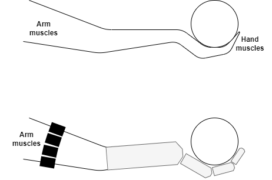

## Brainstorming Ideas

#### Topology
* T1. [**DONE**] Custom skeleton (e.g. model 1 individual finger, or a hand with 6 fingers)
* T2. [**DONE**] Custom shapes (e.g. different 3D shapes of body parts)
* T3. [**DONE**] Custom degrees of freedom in joints
* T4. [**DONE**] Custom ranges of joint rotations
* T5. Inverse kinematics
* T6. Soft tissue and deformations

#### Sensors and feedback
* S1. [**DONE**] Custom positions of sensors
* S2. [**DONE**] Feedback from joint positions
* S3. [**DONE**] Collision detection with external objects
* S4. [**DONE**] Self-collision detection
* S5. [**DONE**] Visual feedback with color heatmaps
* S6. [**DONE**] Visual feedback with vectors
* S7. Visual feedback with tables/graphs
* S8. Gravity for gripped objects

#### Interface
* I1. Interface API for using from outside
* I2. [**DONE**] Programming control via API
* I3. [**DONE**] API for model definition
* I4. [**DONE**] API for model motion

#### Visual
* V1. Interactive controls
* V2. Stock objects to grap and hold
* V3. [**DONE**] Importing GLTF body parts
* V4. Exporting GLTF models
* V5. Customs warning (aka virtual pain)

#### Postures
* P1. Mapping between input data and posture
* P2. Predefined collection of postures
* P3. Predefined animations
* P4. [**DONE**] Scenes with several models
* P5. Self-balancing of pressure
* P6. [**DONE**] Predefined models (e.g. hands)
* P7. Self-learning mode
* P8. Macros mode (e.g. grip for rod, ball, cup; handshake, ...)

#### Documents
* D1. [**DONE**] GitHub project
* D2. [**DONE**] User documentation
* D3. Educational content
* D4. Academic papers
* D5. [**DONE**] Social network disseminations (e.g. videos)

#### Initially needed information
* Close-up images of hand prototype
* Details about input signals and communication
* Mapping between input signals and angles
* Mapping between collision and feedback signals

## Other Ideas

### Grip Lock

A real hand holding an object can be controlled by two group of muscles. The 
hand muscles control the gripping, and the arm muscles can move the whole arm.
These two groups of muscles work independently, so a person cam move the arm
while holding an object.

A prosthetic hand is controlled by arm muscles only, so it is impossible for
a person to both hold an object and move the arm, because arm movement might be
interpreted as some hand gesture and the object might be dropped.

The **grip lock** concept resolves this problem by switching the target of
arm muscles.

* When the grip is locked, the prosthetic hand has a firm grip that does not
change when arm muscles are used. So, arm muscles controls the arm.

* When the grip is unlocked, the proshthetic hand is controlled by the arm
muscles.

Thus the process of grabbing and moving an object is:

* Lock the grip, and move the arm so that it reaches the object
* Unlock the grip and move the prosthetic finger to grab the object
* Lock the grid to keep the object grabbed, and move the arm
* Unlock the grip to release the object

To implement the **grip lock** functionality, it is required to have a special
lock/unlock signal generate by either the arm muscles, or by other means.

### Grasp taxonomy

The current scope of recognizable gestures contains 9 gestures. Towever, there
is a taxonomy of gestures where more gestures are being described. It would be
nice if all these gestures are also supported.

A few pointers:

* Thomas Feix, Javier Romero, Heinz-Bodo Schmiedmayer, Aaron M. Dollar, and Danica Kragic
(2016) [The GRASP Taxonomy of Human Grasp Types](https://is.mpg.de/uploads_file/attachment/attachment/256/grasp_taxonomy.pdf),
IEEE TRANSACTIONS ON HUMAN-MACHINE SYSTEMS, VOL. 46, NO. 1, FEBRUARY 2016, pp. 66-77

* Mark Cutkosky (1989) [On Grasp Choice, Grasp Models, and the Design of Hands for Manufacturing Tasks](http://bdmlx.stanford.edu/twiki/pub/Seabed/LiteratureReview/Cutkosky_-_1989_-_On_Grasp_Choice_Grasp_Models_and_the_Design_of_Hands_for_Manufacturing_Tasks.pdf),
IEEE TRANSACTIONS ON ROBOTICS AND AUTOMATION, VOL. 5, NO. 3. JUNE 1989, pp. 269-279

* Hyeonjun Park, Donghan Kim (2020) [An open-source anthropomorphic robot hand system: HRI hand](https://www.sciencedirect.com/science/article/pii/S2468067220300092),
HardwareX, Volume 7, April 2020, e00100

* Erika Nathalia Gama Melo, Oscar Fernando Aviles Sanchez, Darlo Amaya Hurtado (2014) [Anthropomorphic robotic hands: a review](http://www.scielo.org.co/scielo.php?script=sci_arttext&pid=S0122-34612014000200007)
Ingeniería y Desarrollo, vol.32, no.2, Barranquilla July/Dec. 2014

