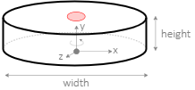
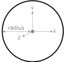

# Predefined Parts

The Virtual Prosthetics library provides an API for all its functionalily. In
this document all times are in seconds, all sizes are in meters, all angles are
in radians and all indices start from 0.

* **[Predefined parts](#predefined-parts)**
	* <small>[Motors](#motors): [MotorX](#motorx), [MotorY](#motory), [MotorZ](#motorz)</small>
	* <small>[Shapes](#shapes): [Ball](#ball), [Box](#box), [Phalange](#phalange), [EndPhalange](#endphalange), [LeftPalm](#leftpalm), [RightPalm](#rightpalm)</small>


# Predefined parts

## Motors

Motor parts are robot parts that can rotate around one of the axes. Thus, each
motor has DOF=1. Higher DOF is achieved by connecting several motors.


### MotorX

```js
MotorX( min, max, def, width=0.1, height=0.05 )
```

Class. Defines a simple motor that rotates around the X axis. The available
range for the rotation is from `min` to `max`. The initial value is `def`.
The size of the motor is defined by the optional parameters `width` and `height`.
There is one slot at position (0,0,0).


Example:

```js
motor = new MotorX( 0, Math.PI, Math.PI/2 );
```


### MotorY

```js
MotorY( min, max, def, width=0.3, height=0.05 )
```

Class. Defines a simple motor that rotates around the Y axis. The available
range for the rotation is from `min` to `max`. The initial value is `def`.
The size of the motor is defined by the optional parameters `width` and `height`.
There is one slot at position (0,`height`,0).



Example:

```js
motor = new MotorY( 0, Math.PI, Math.PI/2 );
```


### MotorZ

```js
MotorZ( min, max, def, width=0.1, height=0.05 )
```

Class. Defines a simple motor that rotates around the Z axis. The available
range for the rotation is from `min` to `max`. The initial value is `def`.
The size of the motor is defined by the optional parameters `width` and `height`.
There is one slot at position (0,0,0).


Example:

```js
motor = new MotorZ( 0, Math.PI, Math.PI/2 );
```


## Shapes

Shapes are robot parts without motors. They cannot be rotated, unless they
are attached to a motor or are set as a motor with [`setMotor`](#setmotor).


### Ball

```js
Ball( radius=1.0, color='dimgray' )
```

Class. Defines a ball shape with given `radius` and `color`. The shape has no slots.



Example:

```js
part = new Ball( 2 );
```


### Box

```js
Box( sizex=1.0, sizey=1.0, sizez=1.0, color='dimgray' )
```

Class. Defines a box shape with given sizes long its axes `sizex`, `sizey` and
`sizez`, and `color`. The shape has no slots.


Example:

```js
part = new Box( 2, 1, 2 );
```


### Phalange

```js
Phalange( length=1.0, width=0.3, thickness=0.3 )
```

Class. Defines a phalange-like shape for attachment to Z-motor. The parameters
`length`, `width` and `thickness` define the size of the part. There is one slot
at the top at position (0,`length`,0).


Example:

```js
part = new Phalange( 1, 0.2, 0.2 );
```


### EndPhalange

```js
EndPhalange( length=1.0, width=0.3, thickness=0.3 )
```

Class. Defines a phalange-like shape for attachment to Z-motor. The parameters
`length`, `width` and `thickness` define the size of the part. There are no
slots. The `EndPhalange` looks almost like `Phalange`, but is intended to be the
last part of a chain of phalanges. It has no slots.


Example:

```js
part = new EndPhalange( 1, 0.2, 0.2 );
```


### LeftPalm

```js
LeftPalm( length=1.4, width=1.4, thickness=0.3 )
```

Class. Defines a shape for palm of left hand. The parameters `length`, `width`
and `thickness` define the size of the palm. There are five slots for attaching
each finger.


Example:

```js
part = new LeftPalm( 1.5, 0.9, 0.3 );
```


### RightPalm

```js
RightPalm( length=1.4, width=1.4, thickness=0.3 )
```

Class. Defines a shape for palm of right hand. The parameters `length`, `width`
and `thickness` define the size of the palm. There are five slots for attaching
each finger.


Example:

```js
part = new RightPalm( 1.5, 0.9, 0.3 );
```


