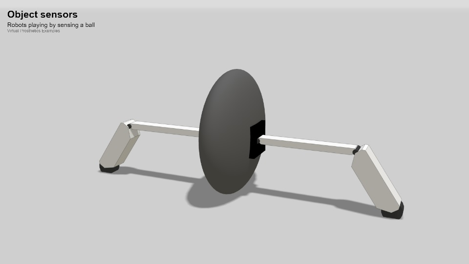
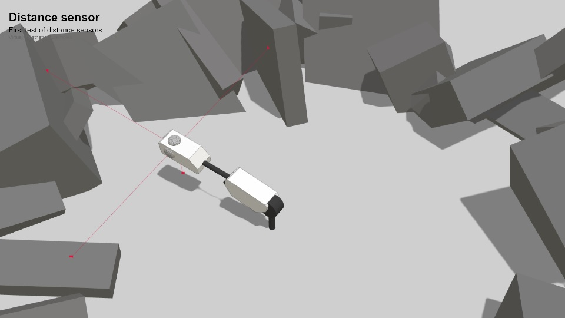
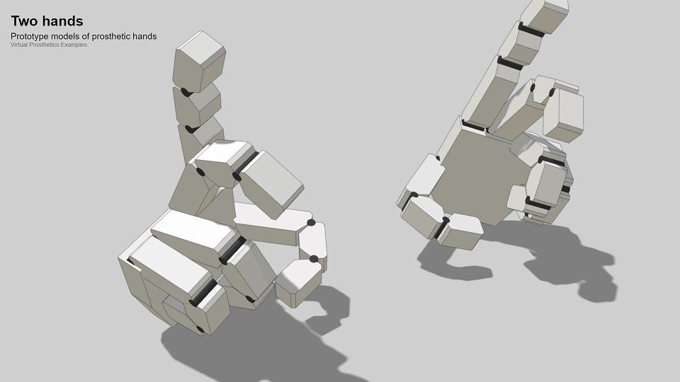

# Virtual prosthetics social activities

### Tweets

---

<blockquote class="twitter-tweet">
It took some time to implement the sense of collision and object touching by using cannon-es for this. This is a demo of two robots playing with a ball. The ball compression is done manually.<a href="https://twitter.com/hashtag/VirtualProsthetics?src=hash&amp;ref_src=twsrc%5Etfw">#VirtualProsthetics</a> <a href="https://twitter.com/hashtag/FMI?src=hash&amp;ref_src=twsrc%5Etfw">#FMI</a> <a href="https://twitter.com/hashtag/SU?src=hash&amp;ref_src=twsrc%5Etfw">#SU</a> <a href="https://twitter.com/hashtag/ThreeJS?src=hash&amp;ref_src=twsrc%5Etfw">#ThreeJS</a> <a href="https://twitter.com/hashtag/CannonES?src=hash&amp;ref_src=twsrc%5Etfw">#CannonES</a> <a href="https://t.co/jW6zuHaDr2">pic.twitter.com/jW6zuHaDr2</a>
&mdash; Pavel Boytchev (@PavelBoytchev) <a href="https://twitter.com/PavelBoytchev/status/1646460819763331072?ref_src=twsrc%5Etfw">April 13, 2023</a></blockquote>

---

<blockquote class="twitter-tweet">
Touch sensors sense when they are pressed against another object and return a pressure level. This video shows prosthetic fingers grabbing random pebbles.  Sadly, touch sensors are not enough for collision detection.<a href="https://twitter.com/hashtag/VirtualProsthetics?src=hash&amp;ref_src=twsrc%5Etfw">#VirtualProsthetics</a> <a href="https://twitter.com/hashtag/FMI?src=hash&amp;ref_src=twsrc%5Etfw">#FMI</a> <a href="https://twitter.com/hashtag/SU?src=hash&amp;ref_src=twsrc%5Etfw">#SU</a> <a href="https://twitter.com/hashtag/ThreeJS?src=hash&amp;ref_src=twsrc%5Etfw">#ThreeJS</a> <a href="https://t.co/T5d5eqtAeJ">pic.twitter.com/T5d5eqtAeJ</a>
&mdash; Pavel Boytchev (@PavelBoytchev) <a href="https://twitter.com/PavelBoytchev/status/1635762229730504706?ref_src=twsrc%5Etfw">March 14, 2023</a></blockquote>

---

<blockquote class="twitter-tweet">
Added distance sensors – when you design a robot you can place them wherever you want. These sensors will be used by prosthetic devices to capture their surroundings, assist navigation and avoid collisions. <a href="https://twitter.com/hashtag/VirtualProsthetics?src=hash&amp;ref_src=twsrc%5Etfw">#VirtualProsthetics</a> <a href="https://twitter.com/hashtag/FMI?src=hash&amp;ref_src=twsrc%5Etfw">#FMI</a> <a href="https://twitter.com/hashtag/SU?src=hash&amp;ref_src=twsrc%5Etfw">#SU</a> <a href="https://twitter.com/hashtag/ThreeJS?src=hash&amp;ref_src=twsrc%5Etfw">#ThreeJS</a> <a href="https://t.co/oNxWPx1UOy">pic.twitter.com/oNxWPx1UOy</a>
&mdash; Pavel Boytchev (@PavelBoytchev) <a href="https://twitter.com/PavelBoytchev/status/1633067541147930625?ref_src=twsrc%5Etfw">March 7, 2023</a></blockquote>

---

<blockquote class="twitter-tweet">
Started a new project for Virtual Prosthetics. The work is in collaboration with <a href="https://twitter.com/Univ_Aizu?ref_src=twsrc%5Etfw">@Univ_Aizu</a>. Here are a few preliminary demos of the 3D module. I&#39;m yet to face the challenges of modelling physical constraints, tactile sense and virtual pain.<a href="https://twitter.com/hashtag/VirtualProsthetics?src=hash&amp;ref_src=twsrc%5Etfw">#VirtualProsthetics</a> <a href="https://twitter.com/hashtag/FMI?src=hash&amp;ref_src=twsrc%5Etfw">#FMI</a> <a href="https://twitter.com/hashtag/SU?src=hash&amp;ref_src=twsrc%5Etfw">#SU</a> <a href="https://twitter.com/hashtag/ThreeJS?src=hash&amp;ref_src=twsrc%5Etfw">#ThreeJS</a> <a href="https://t.co/xz0kJSNk8M">pic.twitter.com/xz0kJSNk8M</a>
&mdash; Pavel Boytchev (@PavelBoytchev) <a href="https://twitter.com/PavelBoytchev/status/1631712716825018368?ref_src=twsrc%5Etfw">March 3, 2023</a></blockquote>

