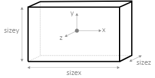
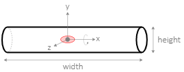

# User guide

* **[Virtual Prosthetics](#virtual-prosthetics)**<small><br>
  &ndash; [Installation](#installation), [Options](#options)</small>
* **[Robot parts](#robot-parts)**<small><br>
  &ndash; [Common shapes](#common-shapes): [Ball](#ball), [Box](#box)<br>
  &ndash; [Motors](#motors): [MotorX](#motorx), [MotorY](#motory), [MotorZ](#motorz)</small>
* **[Hand parts](#hand-parts)**<small><br>
  &ndash; [Edged hand](#edged-hand): [EdgedFinger](#edgedfinger), [EdgedTip](#edgedtip), [EdgedPalm](#edgedpalm)<br>
  &ndash; [Round hand](#round-hand): </small>


# Virtual Prosthetics

> ### Installation

**Virtual Prosthetics** is distributed as a single JavaScript file called
`virtual-prosthetics.js`. It does not require any specific installation. The
library file could be placed anywhere within the project folder tree or hosten
on a CORS-enabled repository. 


The library provides its functionality via modules and it is used within a
module script:


```html
<script type="module">
	// JS code
</script>
```

The library is loaded (and activated) via `import` statement. The following
example assumes the library is in current folder:

```js
import * as Prosthetic from "./virtual-prosthetics.js";
```

If the library is activated, it prints the text **Virtual Prosthetics 1.0** in
the console. Activation creates a virtual scene with the Virtual Prosthetics
logo spinning in the center:

[<kbd></kbd>](../examples/empty-scene.html)


> ### Options

Some run-time aspects of the library can be controlled by URL parameters (also
called [query strings](https://en.wikipedia.org/wiki/Query_string)). Some of the
parameters are pairs of **name=vaue**, others are just flags and are only
**name**.

* `engine=‹engine-name›`

	Controls which physics engine to use. Available options are `engine=cannon` 
	that sets [Cannon-es](https://pmndrs.github.io/cannon-es/) as physics engine
	(default) and `engine=native` for a native engine. Currently on the cannon
	engine is fully functional.

* `touch-color=‹color-name›`

	Controls the emissive color indication of colliding parts. Any [CSS color name](https://www.w3schools.com/tags/ref_colornames.asp) can be used, but dark
	colors have minimal or no effect. For example, `touch-color=crimson` adds a
	pale pinkinsh color to parts, while `touch-color=black` does not produce any
	effect.

* `debug-physics`

	Shows how the physics engine "sees" the parts. Each part has an invisible
	convex envelope that is used for collision testing. If th flag `debug-physics`
	is used, the edges of the envelope are shown. By default they are hidden.

* `show-slots`

	Shows the positions and orientations of all slots. By default slots are hidden.


Example:
```
../examples/two-hands.html?engine=cannon&touch-color=crimson&debug-physics&show-slots
```

[<kbd></kbd>](https://boytchev.github.io/virtual-prosthetics/examples/two-hands.html?engine=cannon&touch-color=crimson&debug-physics&show-slots)


# Robot parts

Robot parts are predefined [parts](api.md#parts-api) that have images. Some
robot parts also have invisible physics envelopes that are used the the physics
engine for collision detection.


## Common shapes

Shapes are robot parts without motors. They can be positioned with
[setPosition](api.md#setposition-1) and rotated with [setRotation](api.md#setrotation-1).
Common shapes have exact physics envelopes and the engine uses them for precise
collision detection. 

Source code: [src/part-shapes.js](https://github.com/boytchev/virtual-prosthetics/blob/main/src/part-shapes.js)


> ### Ball

```js
Ball( )
Ball( radius )
Ball( radius, color )
```

Class. Defines a ball shape with optional `radius` (by default 1) and `color` (by
default [DimGray](https://www.w3schools.com/colors/color_tryit.asp?color=DimGray)).
The ball has no slots.


Example:

```js
part = new Prosthetic.Ball( 2 );
```


> ### Box

```js
Box( )
Box( sizex, sizey, sizez )
Box( sizex, sizey, sizez, color )
```

Class. Defines a box shape with optional sizes along its axes `sizex`, `sizey` and
`sizez` (by default all sizes are 1), and `color`(by default DimGray). The box
has no slots.



Example:

```js
part = new Prosthetic.Box( 2, 1, 2 );
```


## Motors

Robot motors are extensions of [motor](api.md#motor) class with predefined axis
of rotation and image. The motors have no physics envelopes and the engine
ignores them during collision detection. 

Source code: [src/part-motors.js](https://github.com/boytchev/virtual-prosthetics/blob/main/src/part-motors.js)


> ### MotorX

```js
MotorX( min, max, def )
MotorX( min, max, def, width, height )
```

Class. Defines a motor that rotates around the X axis. The available range for
the rotation is from `min` to `max`. The initial value is `def`. The motor is
drawn as a cylinder with sizes `width` and `height` (by default width=0.1 and
height=0.05). Slot 0 is at the center of the motor.



Example:

```js
motor = new Prosthetic.MotorX( 0, Math.PI, Math.PI/2 );
```


### MotorY

```js
MotorY( min, max, def )
MotorY( min, max, def, width, height )
```

Class. Defines a motor that rotates around the Y axis. The available range for
the rotation is from `min` to `max`. The initial value is `def`. The motor is
drawn as a cylinder with sizes `width` and `height` (by default width=0.1 and
height=0.05). Slot 0 is at the top of the motor.


Example:

```js
motor = new Prosthetic.MotorY( 0, Math.PI, Math.PI/2 );
```


### MotorZ

```js
MotorZ( min, max, def, width=0.1, height=0.05 )
```

Class. Defines a simple motor that rotates around the Z axis. The available
range for the rotation is from `min` to `max`. The initial value is `def`.
The motor is drawn as a cylinder with sizes `width` and `height`. Slot 0 is at
the center of the motor.


Example:

```js
motor = new Prosthetic.MotorZ( 0, Math.PI, Math.PI/2 );
```


# Hand parts

Hands parts are predefined robot parts that are used to build antropomorphic
robots resembling a human hand. Hands parts are: a finger, a finger tip, and
a palm:


## Edged hand

The edged hand parts are convex polyhedra with straight edges. The main
properties of edged hand parts are:

* easily resized, preserving the overall shape
* simple shapes, less computationally intensive
* generated on-the-fly without external resources
* relatively high precision of collision detection

Source code: [src/part-hand-edged.js](https://github.com/boytchev/virtual-prosthetics/blob/main/src/part-hand-edged.js)


> ### EdgedFinger

```js
EdgedFinger( )
EdgedFinger( length )
EdgedFinger( length, width, thickness )
```

Class. Defines an edged finger shape intended for attachment to Z-motor. The
optional parameters `length` (by default 1), `width` (by default 0.3) and
`thickness` (by default 0.3) define the size of the part. There is one slot
at the top at position (0,`length`,0).


Example:

```js
part = new Prosthetic.EdgedFinger( 1, 0.2, 0.2 );
```


> ### EdgedTip

```js
EdgedTip( )
EdgedTip( length )
EdgedTip( length, width, thickness )
```

Class. Defines a tip of an edged finger shape for attachment to Z-motor. The
optional parameters `length` (by default 1), `width` (by default 0.3) and
`thickness` (by default 0.3) define the size of the part. There are no slots.
The `EdgedTip` looks almost like `EdgedFinger`, but is intended to be the
last part of a chain of fingers. 


Example:

```js
part = new Prosthetic.EdgedTip( 1, 0.2, 0.2 );
```


> ### EdgedPalm

```js
EdgedPalm( left )
EdgedPalm( left, length )
EdgedPalm( left, length, width, thickness )
```

Class. Defines a shape for an edged palm. The palm exists in two symmetrical
shapes. If `left` is true, the palm is a left-hand palm, otherwise it is a
right-hand palm. The parameters `length` (by default 1.4), `width` (by default 1.4)
and `thickness` (by default 0.3) define the size of the palm. There are five
slots for attaching fingers, the slot for the thumb is 0.


Example:

```js
part = new Prosthetic.EdgedPalm( true, 1.5, 0.9, 0.3 );
```


## Round hand

The round hand parts are shaped like ellipsoids and have connectors for
attaching other round parts. The main properties of round hand parts are:

* smoother and more aesthetic appearance
* shapes provided from external GLTF files
* approximate precision of collision detection

Source code: [src/part-hand-round.js](https://github.com/boytchev/virtual-prosthetics/blob/main/src/part-hand-round.js)
