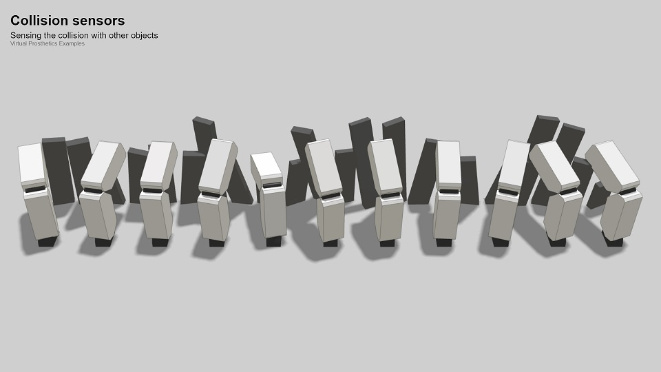
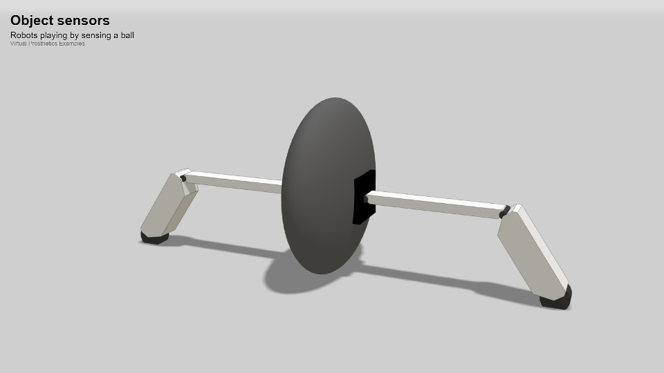
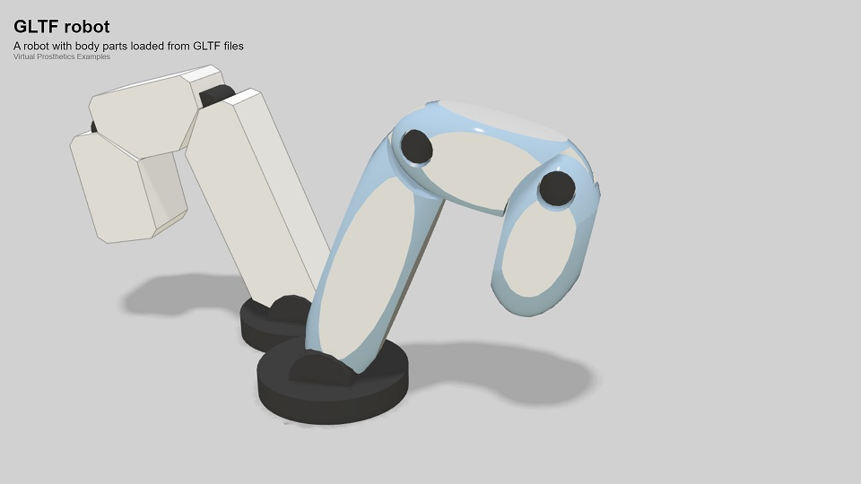
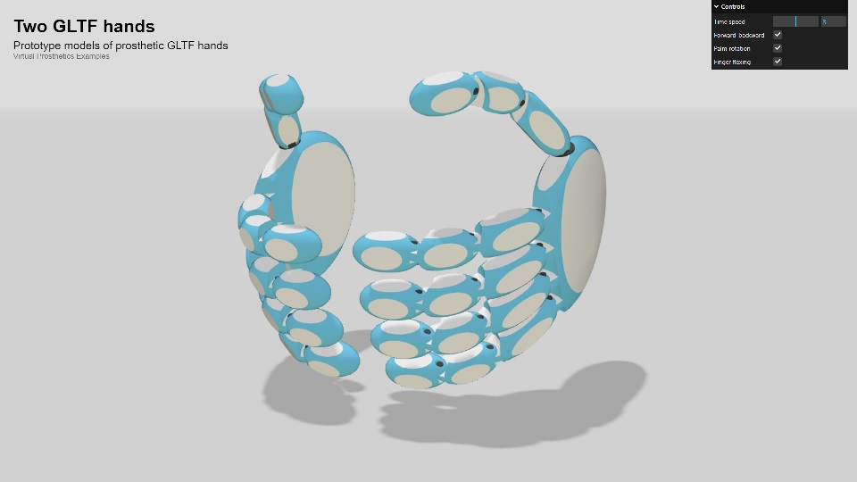

# Virtual prosthetics
Modeling tool for virtual prosthetic body parts

* [Virtual prosthetics](docs/api.md)
* [Social activities](docs/social.md)
* [Brainstorming ideas](docs/brainstorming-ideas.md)

## Examples

[<kbd></kbd>](examples/empty-scene.html)
[<kbd></kbd>](examples/simple-robot.html)
[<kbd></kbd>](examples/several-robots.html)
[<kbd></kbd>](examples/robot-dance.html)
[<kbd></kbd>](examples/two-hands.html)
[<kbd></kbd>](examples/distance-sensors.html)
[<kbd></kbd>](examples/position-sensors.html)
[<kbd></kbd>](examples/touch-sensors.html)
[<kbd></kbd>](examples/collision-sensors.html)
[<kbd></kbd>](examples/object-sensors.html)
[<kbd></kbd>](examples/gltf-robot.html)
[<kbd></kbd>](examples/two-gltf-hands.html)

